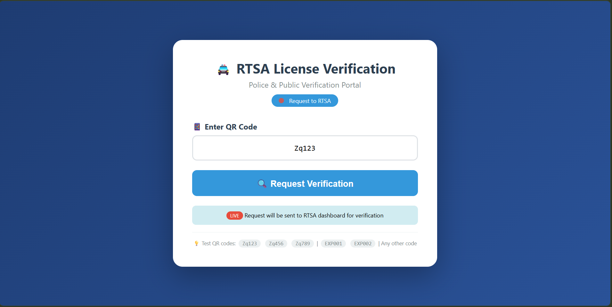
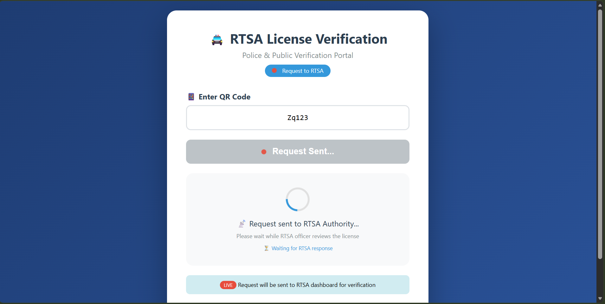
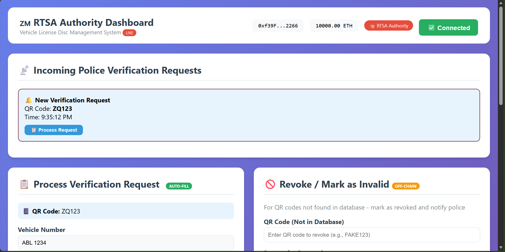
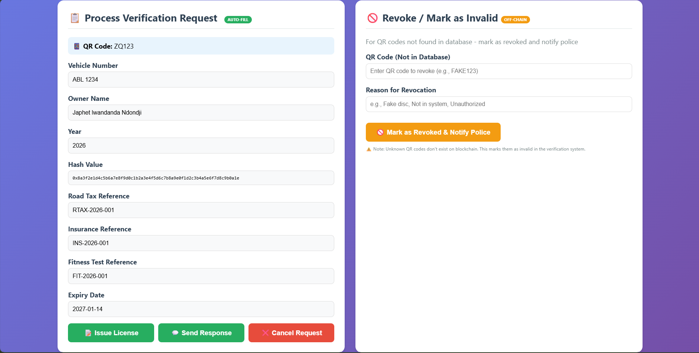
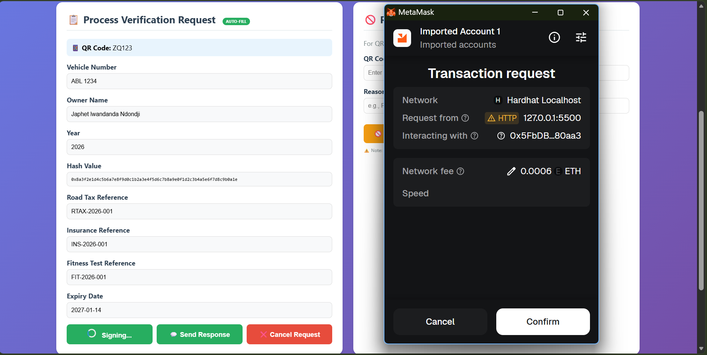
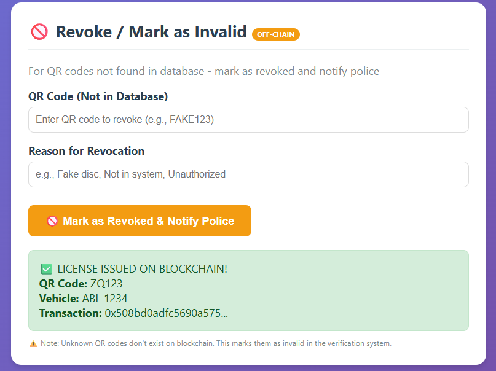
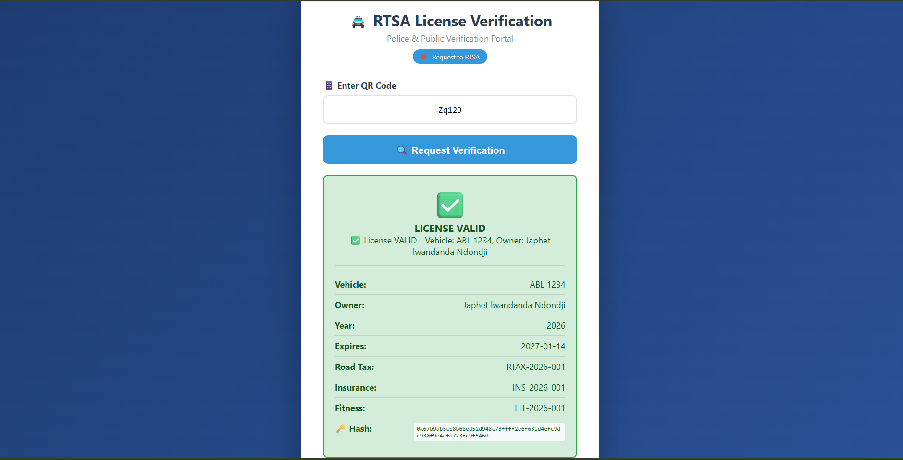

# Zambia Vehicle License Disc Verification System

A blockchain-based vehicle license disc verification system designed to demonstrate how cryptographic verification and immutable blockchain records can support vehicle license validation in Zambia.

The system provides interfaces for the Road Transport and Safety Agency (RTSA) and traffic police, allowing vehicle license information to be issued, verified, reviewed, and validated through a blockchain-backed workflow.

This project was developed as an academic cryptography project and demonstrates the practical application of blockchain technology, smart contracts, cryptographic hashing, wallet integration, and web-based vehicle license verification.

---

## Overview

Vehicle license disc verification can be challenging when traffic officers rely primarily on physical documentation or records that may be difficult to authenticate immediately.

The Zambia Vehicle License Disc Verification System explores a blockchain-based approach where vehicle license information can be represented using cryptographic hashes and recorded through a smart contract.

RTSA acts as the issuing and verification authority, while traffic police can submit vehicle license verification requests and receive verification feedback.

The system combines:

- Blockchain technology
- Solidity smart contracts
- Cryptographic hashing
- MetaMask wallet integration
- QR-based verification
- Vehicle license records
- RTSA verification workflows
- Traffic police verification interfaces
- Smart-contract event logging

---

## Problem Statement

Traditional vehicle license verification may depend on physical documents and centralized records that require officers to manually confirm whether a presented license is genuine, active, expired, or revoked.

A fraudulent or altered vehicle license disc may therefore be difficult to identify through visual inspection alone.

This academic project explores the use of blockchain technology as an additional verification layer.

Instead of relying only on the physical license disc, relevant license information can be represented by a cryptographic hash and registered through a blockchain smart contract.

The blockchain record can then be queried to determine whether the corresponding license:

- Exists
- Was issued by an authorized entity
- Has been revoked
- Has expired
- Matches the expected vehicle record

---

## Proposed Solution

The system models RTSA as the primary vehicle license issuing and verification authority.

When a vehicle license is issued, its associated information is represented through a cryptographic hash and recorded using the `LicenseRegistry` smart contract.

Traffic police can initiate a verification request using the police verification interface.

RTSA can then review the associated vehicle and driver information and use the blockchain-backed license record to support the verification process.

The result is returned to the traffic police interface.

This creates a workflow where blockchain technology provides an additional mechanism for validating the authenticity and status of vehicle license records.

---

# Application Preview

The following screenshots demonstrate the end-to-end verification workflow implemented for the academic prototype.

## 1. Police QR-Code Scanner

<p align="center">
  
</p>

The traffic police interface provides a QR-code-based demonstration for identifying vehicle license records.

Test codes were used during the academic demonstration to simulate different vehicle license records and verification scenarios.

---

## 2. Police Verification Request

<p align="center">
  
</p>

After identifying the vehicle license information, the traffic police interface can create and submit a verification request to RTSA.

The request represents a police officer requesting confirmation of the vehicle and license information presented during an inspection.

---

## 3. RTSA Receives Verification Request

<p align="center">
  
</p>

The RTSA interface displays verification requests received from the traffic police verification system.

RTSA can open a request and begin reviewing the corresponding vehicle and license information.

---

## 4. RTSA Reviews Vehicle Details

<p align="center">
  
</p>

RTSA reviews the associated driver, vehicle, and license information before completing the verification process.

This stage demonstrates how institutional records and blockchain-backed license information can work together during verification.

---

## 5. Blockchain License Verification

<p align="center">
  
</p>

The license verification process interacts with the blockchain smart contract.

MetaMask is used for wallet-based transaction authorization where blockchain operations require an authorized account.

The smart contract can determine whether the corresponding license exists and whether it remains valid.

---

## 6. RTSA Verification Result

<p align="center">
  
</p>

After reviewing and validating the vehicle license information, RTSA completes the verification process and sends the result back through the system.

---

## 7. Police Receives Verification Feedback

<p align="center">
  
</p>

The traffic police interface receives the verification feedback from RTSA, completing the demonstrated verification workflow.

---

# Verification Workflow

The demonstrated system follows the general workflow below:

1. Traffic police identify or scan vehicle license information.
2. The police interface retrieves the corresponding vehicle information.
3. A verification request is created.
4. The request is submitted to RTSA.
5. RTSA receives the verification request.
6. RTSA reviews the associated driver and vehicle information.
7. The vehicle license record is checked using the blockchain-backed verification functionality.
8. RTSA confirms the verification result.
9. The result is returned to the traffic police interface.
10. Traffic police receive the verification feedback.

The workflow demonstrates how blockchain verification can complement an institutional vehicle licensing process.

---

# Smart Contract

The core blockchain component of the project is the `LicenseRegistry` Solidity smart contract.

The contract manages vehicle license records and provides functionality for:

- License issuance
- License revocation
- License verification
- License expiry validation
- Vehicle license history
- RTSA authority management
- Authorized officer management
- Blockchain event logging

The contract is implemented using Solidity and deployed through the Hardhat development environment.

---

## License Record Structure

A blockchain license record can contain information including:

- Vehicle number
- License year
- Cryptographic license hash
- Road tax reference
- Insurance reference
- Fitness reference
- Revocation status
- Issue timestamp
- Expiry timestamp
- Additional metadata

Rather than relying exclusively on plain-text vehicle information, cryptographic hashes can be used to represent license data within the verification process.

---

# Access Control

Administrative blockchain operations are protected through RTSA-based access control.

The smart contract establishes the deploying account as the primary RTSA authority.

Additional blockchain addresses can also be authorized to perform selected RTSA operations.

Restricted operations such as license issuance and revocation are therefore intended to be performed only by:

- The primary RTSA authority
- Authorized RTSA officers

Ordinary users cannot directly perform protected license-management operations through the smart contract.

---

## RTSA Authority

The primary RTSA authority is established when the smart contract is deployed.

This account represents the principal administrative authority of the blockchain registry.

---

## Authorized Officers

The system also supports authorized officers.

The RTSA authority can authorize additional blockchain addresses to perform permitted license-management operations.

Authorized officers can later be deauthorized when their access is no longer required.

This demonstrates how blockchain-based access control can be incorporated into an institutional verification system.

---

# License Issuance

Authorized RTSA accounts can issue vehicle license records through the smart contract.

A license record contains identifying information and a cryptographic hash representing the license.

When a license is successfully issued, the smart contract records the information and generates a blockchain event.

This provides an auditable record of the license issuance operation.

---

# License Verification

The smart contract provides functionality for checking registered vehicle licenses.

A license is considered valid when:

- The license exists
- The license has not been revoked
- The license has not expired

The verification logic therefore considers both revocation status and expiration when determining the current state of a license.

This allows the system to distinguish between an existing blockchain record and a currently valid vehicle license.

---

# License Revocation

RTSA-authorized accounts can revoke a previously issued license.

Revocation may be useful where a vehicle license should no longer be considered valid before its normal expiry date.

Once revoked, the smart contract retains the historical record while marking the license as revoked.

This demonstrates one advantage of maintaining an auditable license history rather than simply deleting invalid records.

---

# License Expiration

License records contain expiry information.

During verification, the smart contract can determine whether the current time has exceeded the recorded expiry timestamp.

An expired license is therefore not considered valid even if the license exists and has not been manually revoked.

---

# Vehicle License History

The smart contract can associate historical license hashes with a vehicle number.

This makes it possible for multiple license records associated with the same vehicle to be retrieved as part of its license history.

The approach demonstrates how blockchain records can preserve historical information while newer licenses are issued.

---

# Blockchain Events

The smart contract generates events for important blockchain operations.

Implemented events include:

- `LicenseIssued`
- `LicenseRevoked`
- `OfficerAuthorized`
- `OfficerDeauthorized`

Blockchain events provide an auditable record of important actions and can also be monitored by client applications.

For example, a frontend application can listen for an issuance or revocation event and update the user interface accordingly.

---

# Technology Stack

## Blockchain

- Solidity
- Ethereum-compatible blockchain
- Hardhat
- Ethers.js

## Web Technologies

- HTML
- CSS
- JavaScript

## Wallet Integration

- MetaMask

## Development Environment

- Node.js
- npm
- TypeScript
- Hardhat local blockchain

## Cryptography

- Keccak-256 hashing
- Cryptographic license identifiers
- Blockchain transaction signing

---

# Security and Cryptography Concepts

The project demonstrates several concepts studied in cryptography and blockchain development.

## Cryptographic Hashing

Vehicle license information can be represented using cryptographic hashes.

Hashing provides a deterministic representation of data that can be used when comparing or validating information without relying solely on the original plain-text record.

---

## Blockchain Immutability

Once transactions are confirmed on a blockchain, the resulting transaction history provides an auditable record of operations performed through the smart contract.

This is useful for demonstrating how license issuance and revocation activities can be recorded.

---

## Access Control

Sensitive smart-contract operations are restricted to RTSA-authorized blockchain accounts.

This helps prevent unauthorized blockchain addresses from issuing or revoking vehicle licenses through the contract.

---

## Transaction Signing

MetaMask provides wallet-based transaction signing.

When an authorized blockchain operation is performed, the associated account must authorize the transaction through its wallet.

This demonstrates the use of asymmetric cryptography and blockchain account ownership in application authorization.

---

## Revocation

A license that was previously valid can be marked as revoked.

The blockchain record remains available for historical purposes while its status indicates that it should no longer be considered valid.

---

## Expiration

The smart contract stores expiry information and evaluates it when determining whether a license remains valid.

---

## Event Logging

Important operations generate blockchain events.

These events provide additional visibility into activities such as license issuance, revocation, and officer authorization.

---

# System Components

The project contains several components that work together to demonstrate the verification process.

## RTSA Dashboard

The RTSA dashboard provides the institutional interface used during the demonstration.

It supports activities associated with reviewing verification requests and interacting with vehicle license information.

---

## Traffic Police Verification Interface

The police verification interface represents the traffic officer's side of the system.

It allows the demonstration of:

- QR-code-based vehicle identification
- Verification requests
- Vehicle license checks
- Verification feedback

---

## LicenseRegistry Smart Contract

The `LicenseRegistry` contract provides the blockchain layer responsible for storing and validating vehicle license records.

---

## MetaMask

MetaMask provides the wallet interface used to connect authorized blockchain accounts to the application.

---

## Hardhat

Hardhat provides the local blockchain development environment used to:

- Compile the smart contract
- Run a local Ethereum-compatible blockchain
- Deploy the contract
- Execute tests
- Interact with development accounts

---

# Project Structure

```text
VehicleLicenseBlockchain/
|
|-- contracts/
|   `-- LicenseRegistry.sol
|
|-- public/
|   |-- database.js
|   |-- rtsa-dashboard.html
|   |-- style.css
|   |-- test-qrcodes.html
|   `-- verify.html
|
|-- scripts/
|   |-- debug-contract.js
|   |-- demo-verification.js
|   |-- deploy-complete.ts
|   |-- deploy.ts
|   `-- gas-report.js
|
|-- test/
|   |-- complete-test-suite.js
|   |-- diagnostic.html
|   `-- student2_tests.html
|
|-- docs/
|   `-- screenshots/
|       |-- 01-police-qr-scanner.png
|       |-- 02-police-verification-request.png
|       |-- 03-rtsa-received-request.png
|       |-- 04-rtsa-review-details.png
|       |-- 05-rtsa-license-verification.png
|       |-- 06-rtsa-verification-result.png
|       `-- 07-police-verification-feedback.png
|
|-- frontend-config.json
|-- hardhat.config.ts
|-- package.json
|-- package-lock.json
|-- tsconfig.json
`-- README.md
```

Generated Hardhat build artifacts, cache files, deployment-specific output, and generated TypeChain definitions can be excluded from version control where appropriate.

---

# Installation and Setup

## Prerequisites

Ensure the following tools are available:

- Node.js
- npm
- Git
- MetaMask browser extension
- A modern web browser

Clone the repository:

```bash
git clone https://github.com/EmmanuelPhiri20/Vehicle-Disc-Verifier-Blockchain.git
cd Vehicle-Disc-Verifier-Blockchain
```

Install the project dependencies:

```bash
npm install
```

Compile the Solidity smart contract:

```bash
npx hardhat compile
```

---

# Running the Local Blockchain

Start the local Hardhat blockchain:

```bash
npx hardhat node
```

Keep this terminal running.

Hardhat provides local development accounts that can be used when testing the project.

These accounts are intended strictly for local development and demonstration.

---

# Deploying the Smart Contract

Open another terminal in the project directory and run:

```bash
npx hardhat run scripts/deploy-complete.ts --network localhost
```

The deployment process deploys the `LicenseRegistry` contract to the local Hardhat blockchain.

The deployment tooling also generates local configuration information used by the frontend.

A local deployment may produce configuration similar to:

```json
{
  "network": "localhost",
  "rpcUrl": "http://127.0.0.1:8545"
}
```

The actual contract address is deployment-specific and should not be treated as a permanent production address.

---

# MetaMask Configuration

When testing wallet-dependent functionality, MetaMask should be connected to the local Hardhat blockchain.

Typical local development configuration:

```text
Network: Hardhat Localhost
RPC URL: http://127.0.0.1:8545
Chain ID: 31337
Currency Symbol: ETH
```

A development account provided by the local Hardhat node can then be imported into MetaMask for local testing.

> Never use local development private keys for real cryptocurrency accounts or production blockchain deployments.

---

# Running the Web Interface

The web application can be served using a local HTTP server.

For example:

```bash
npx http-server public -p 8080
```

The local web server can then expose the project interfaces through a browser.

For example:

```text
http://127.0.0.1:8080/rtsa-dashboard.html
```

and:

```text
http://127.0.0.1:8080/verify.html
```

The local Hardhat blockchain should remain running while testing blockchain-dependent functionality.

---

# Testing

Compile the project:

```bash
npx hardhat compile
```

Run the configured Hardhat test suite:

```bash
npx hardhat test
```

The repository also contains additional diagnostic and demonstration utilities used during development and academic testing.

These include functionality for testing areas such as:

- Blockchain connectivity
- MetaMask integration
- Contract interaction
- License verification
- License issuance
- License revocation
- Event handling

---

# Demonstration Environment

The academic demonstration uses a local development environment rather than a production blockchain.

The typical environment consists of:

```text
Traffic Police Interface
        |
        v
Verification Request
        |
        v
RTSA Interface
        |
        v
MetaMask / Authorized Account
        |
        v
LicenseRegistry Smart Contract
        |
        v
Hardhat Local Blockchain
        |
        v
Verification Result
        |
        v
Traffic Police Interface
```

This architecture allows the complete concept to be demonstrated without requiring deployment to a public blockchain network.

---

# Academic Context

This system was developed as a university cryptography group project exploring the practical application of blockchain technology to a real-world verification problem.

The project combined several areas of software development and cryptography, including:

- Solidity smart-contract development
- Blockchain infrastructure
- Cryptographic hashing
- Wallet integration
- Web interface development
- Vehicle license verification workflows
- Access control
- Blockchain event handling
- Testing and demonstration

The implementation is primarily an academic prototype and technology demonstration rather than a production system operated by RTSA.

RTSA and other institutional references are used to model the intended real-world scenario for the academic project.

---

# Project Status

The academic prototype demonstrates an end-to-end vehicle license verification concept.

Implemented or demonstrated functionality includes:

- Smart contract development
- Smart contract deployment
- Vehicle license issuance
- Vehicle license verification
- License revocation
- License expiry validation
- RTSA authority control
- Authorized officer management
- MetaMask integration
- Traffic police verification requests
- RTSA request review
- Vehicle and license information review
- Verification feedback
- QR-code-based demonstration
- Blockchain event logging
- Local Hardhat blockchain integration

The repository is maintained as an academic project and portfolio demonstration of blockchain, cryptography, smart-contract development, and web application integration.

---

# Current Limitations

Because this project was developed as an academic prototype, several components would require further development before real-world deployment.

Current limitations include:

- Local blockchain deployment rather than a production blockchain network
- Demonstration-oriented QR codes
- Prototype institutional workflows
- Development-focused wallet configuration
- Limited production identity management
- No integration with actual RTSA infrastructure
- No integration with official national vehicle databases
- Development-oriented configuration and testing utilities
- Additional security assessment would be required for production use

These limitations do not prevent the project from demonstrating its core blockchain and cryptography concepts.

---

# Future Improvements

Possible future improvements include:

- Deployment to a public Ethereum-compatible test network
- Improved QR-code generation and scanning
- Stronger identity and role management
- Persistent off-chain database integration
- Improved RTSA authentication
- Improved traffic police authentication
- More comprehensive automated testing
- Improved responsive user interfaces
- Production-grade blockchain key management
- Enhanced audit and reporting functionality
- Improved smart-contract authorization
- Better frontend configuration management
- Integration with institutional APIs
- Integration with real vehicle-registration systems
- Improved handling of license renewal workflows
- Improved monitoring of blockchain events
- Production security assessment

---

# Repository Purpose

This repository is preserved to demonstrate the development and implementation of a blockchain-based verification concept within an academic cryptography project.

It showcases practical experience with:

- Blockchain development
- Solidity
- Smart contracts
- Hardhat
- Ethers.js
- MetaMask
- JavaScript
- HTML
- CSS
- TypeScript
- Cryptographic hashing
- Role-based blockchain authorization
- Blockchain event handling
- Web and blockchain integration

---

# Disclaimer

This project is an academic prototype and is not an official Road Transport and Safety Agency (RTSA) system.

The application, interfaces, vehicle records, QR codes, blockchain deployment, and verification workflows are intended for academic demonstration and software-development purposes.

The project should not be used for real vehicle license verification without further security assessment, production infrastructure, institutional integration, regulatory approval, comprehensive testing, and authorization from the relevant authorities.